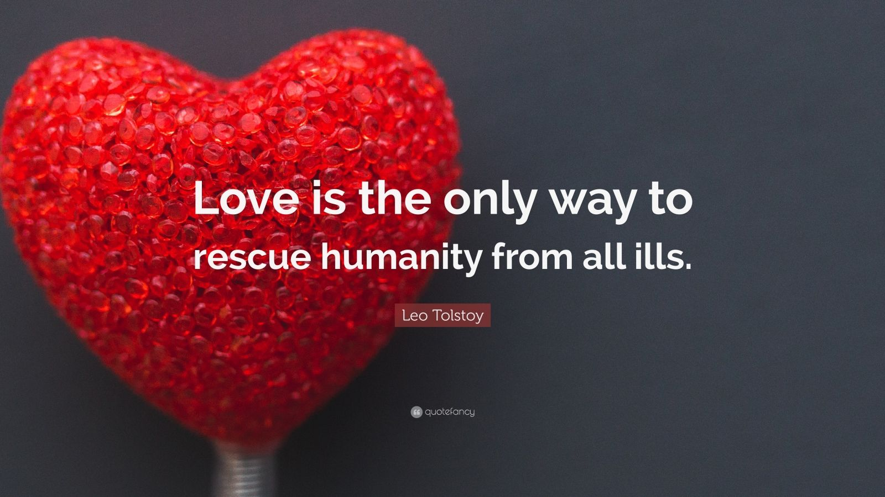

# First HTML Assignment — Nostalgia, Space, and Love

This site began as my first school assignment in HTML. I kept the original content and spirit, and later made small improvements for discoverability and clarity: basic SEO meta tags, Open Graph/Twitter cards, a JSON-LD schema, a sitemap, a robots file, and light code alignment cleanup. Everything else remains true to the original assignment — a nostalgic snapshot of how I love space, altruism, and love.

**Live Site:** https://felixarash.github.io/firsthtml/

## What Stayed Original
- Core text, images, audio, and video content
- Layout and intent of the page
- The personal, reflective tone about love and space

## What I Tweaked
- Added SEO tags (meta description, keywords, canonical)
- Added Open Graph and Twitter card tags
- Added JSON-LD for `WebSite`, `Person`, and `ImageObject`
- Added `sitemap.xml` and `robots.txt`
- Cleaned minor alignment/semantics without changing the story

## Nostalgia
Space taught me wonder. Love taught me kindness. Altruism taught me to care beyond myself. This page is a memory of learning, curiosity, and the optimism that simple HTML can carry a big feeling.

## Images

## A Few Love Quotes
> "We are made of star‑stuff." — Carl Sagan

> "To love is to recognize yourself in another." — Eckhart Tolle

> "The smallest act of kindness is worth more than the grandest intention." — Oscar Wilde

> "Love is the only force capable of transforming an enemy into a friend." — Martin Luther King Jr.

## How to View Locally
- Open `index.html` in a browser, or serve the folder with any static server.

## Credits
- Helix Nebula image link: https://www.nasa.gov/multimedia/imagegallery/image_feature_2368.html
- External Hubble image: https://apod.nasa.gov/